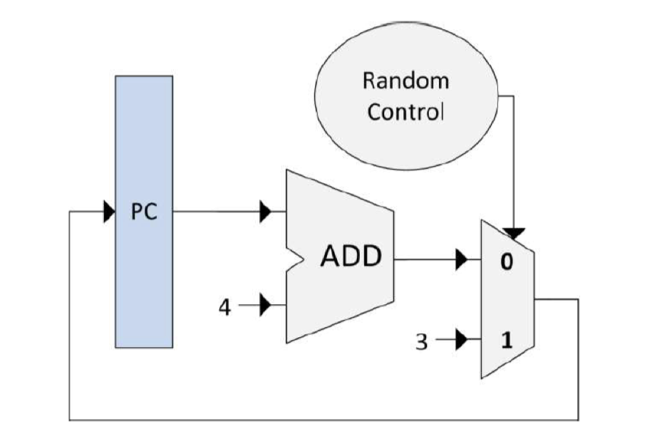

# INF-2200 Computer Architecture and Organization - Mandatory assignment 2

In this assignment, you will implement a simulator of a CPU datapath for a subset of instructions of the MIPS architecture. You will simulate the pipelined datapath described in your textbook. We provide you the pre-code you must use as a starting point. We also provide you with test cases and three sample programs to use during development and to test your solution. 

## Pre-code

### Requirements
Python 3 is required. The pre-code may work out of the box on your system. If not, you must install project dependencies. Assuming you run on Linux, to install project dependencies, use the following commands:
- `virtualenv venv` to create a virtual environment
- `source venv/bin/activate` to activate the environment
- `pip install -r requirements.txt` install the project dependencies

In the rest of the assignment, you need to have your virtual environment activated in order to launch the pre-code and tests. 

### Overview
The pre-code consists of Python files that define the main simulator class’s API and implement the simple single-cycle control and datapath shown in Figure 1.

| |
|:--:|
| **Simple single-cycle control and datapath implemented in pre-code** |

Control and datapath elements are subclasses of the `CPUElement` class (in `src/elements/cpuElement.py`). Each subclass has **three methods** to implement:
- the `__init__` method, where the inputs and outputs fields are created
- the `connectInputs` method, where the input fields of the class are connected to the output fields of another class
- the `writeOutput` method, which computes the output values of the output fields

An example is given in `src/elements/add.py`, which represents the adder in Figure 1. This class initialises two fields for the inputs and one field for the output. During simulation, the output value is computed as the sum of the values of both inputs.

Note that the `connectInputs` method passes the **reference** of the field of the connected element, while the writeOutput writes in the **value** of the field (see `src/elements/add.py` as an example).

The simulator is represented using the `MIPSSimulator` class (`src/mipsSimulator.py`). Control and datapaths elements are created in the `__init__` method of the class. Elements are connected in the `_connectCPUElements` method. The simulator goes one step forward using the **tick** method (calls the `writeOutput` of each element). The simulator must stops when a break instruction is encountered.

The order the different elements are read from and written to is of significance. Additionally, the `writeOutput` method of some elements may need to be called multiple times in a single tick so that the simulation produces the correct results (e.g., during write-back).  

You are encouraged to draw your simulated datapath as you implement it. It is easier to work and debug with a visual version of your implementation.

### Memory files

Memory files representing MIPS programs are given ('.mem' files). These programs are used to test your simulator against different sets of instructions. To read the content of these files and initialise the memory in the simulator, the `initializeMemory()` method must be implemented in the **Memory** class. The InstructionMemory and DataMemory instances can then be initialized by reading instruction and addresses given by the file.    

Each .mem file is a tab-delimited text file, where the first and second columns contain memory addresses and memory content, respectively, both represented as 32-bit hexadecimal numbers, and the third column contains comments. Note that although the comments are assembly code, your simulator should run using the binary code only. Also note that the memory addresses do start from different addresses, **0xbfc00000** and **0x0**, and that the program does not use any memory besides of that defined in the file. 

Although both the instruction memory and data memory elements will initially read the same memory file’s contents, they are treated as separate, isolated entities. The instruction memory will be read-only, and although the data memory also contains the instructions, modifying these will not work and should be avoided.

## Assignment tasks

### Single-cycle simulator capabilities
Your simulator must support the following instructions:
- add: add
- addu: add unsigned
- addi: add immediate
- addiu: add immediate unsigned
- sub: subtract
- subu: subtract unsigned
- and: binary and
- or: binary or
- nor: binary nor
- slt: set less than
- lw: load word
- sw: store word
- bne: branch not equal
- beq: branch equal
- j: jump
- lui: load upper intermediate
- break: break simulator execution

The tests validating that your simulator support these instructions are the **Integration tests** (see **Testing** section). There are 33 tests in total. Your simulator must validate all of them. 

### Pipelining

After having your single-cycle implementation working and handling all the previously listed instructions, your implementation must be pipelined. It must handle data and control hazards. You can choose to implement forwarding, stalling, or another approach. Your report must describe your chosen approach and discuss it’s cost, complexity, and performance.

The simulator given in the pre-code is single-cycle. We **strongly** advise first having the single-cycle implementation working correctly for all listed instructions above before implementing the pipeline.

You must show that your pipelining implementation is working and has better performances than single-cycle. You can refer to the Chapter 4.6 of your textbook to see how to compute performances of single-cycle and pipelined datapaths. You must describe your approach and how you compared performances in the report. 

Additionally, you must show that your pipeline handles data and control hazards. To do so, you must create your own tests with known data and control hazards, and show that your simulator handles them.

### Project management, unit test and design review

In this assignment, you are asked to provide a development plan of your work. You are asked to plan ahead the different parts of your work, how much time do you expect each part would take, and how to ensure your implementation is valid.

The development plan may include the following elements:
- how to implement each type of instructions (e.g., R-types, I-types) and in which order
- time estimation for these implementations 
- implementation of pipelining and time estimation
- handling of data and control hazards
- ensuring your implementation is valid

There is a mandatory design review for the project. At the design review, you must present your development plan.
The design review will be graded **pass** or **no pass** based on the realism of your development plan and the design for your simulator.

In your report, you will have to discuss divergences between your expected design and time estimation, and your actual design and the time you used.

Finally, you must create unit tests for each CPUElement subclass you are creating. These tests aim to help you design each element and ensuring the validity of the implementation of at least their `writeOutput` method.
See the **Testing** section for how to create and launch unit tests.

### Report

The report must contain all necessary information for an expert to evaluate your design and implementation. You must assume that the expert has read the textbook and the assignment text. You do not need, and should not, repeat the content in the textbook.

The report should be maximum 6 pages and contain the following:

1. Description of the datapath and controllers you are simulating.
2. A comparison between the performances of the single-cycle and pipelined datapath simulations
3. Description of data and control hazard handling approach including a discussion about the cost, complexity, and performance of the approach if implemented in hardware.
4. Your development plan and discussion about divergences between the plan and your actual work
5. A description of the test cases you have designed.
6. Summary of known bugs and problems, including a description of which of the provided tests fails (if any).
7. Declaration of large language model use, where you describe how you have used for example ChatGPT.

## Testing
The tests are used both as a mean to ensure that your implementation is valid, and as a development tool. The integration tests test that your simulator supports all previously listed instruction. The manual tests serves the same purpose, but makes you understand algorithms written in mips and compare the expected output with the actual one. The manual tests should also test that the datapath has been pipelined. The unit tests ensure the validity of each datapath component during their development.  

### Integration tests

There are **33** integration tests. These tests are located in the `tests/integration/` directory. You do **not** need to change anything in this directory. Report problems to TAs and wait for fix if you find a bug.

Each test is marked with a header, recognized by the sign '>'. The header is structured like this:

**> 'TestName' 'Destination' 'Expected Value' 'trap or no trap expected'**

There are "value" and "trap" tests. Value tests assert that the registers contains the expected value. Because of this, your simulator **must** contain the `dataMemory.py` and `registerFile.py` components given in the pre-code. These are the components that will be checked by the tests. 

Trap tests intentionally trigger overflow. They validate the ability of your simulator to recognise the overflow and throw an overflow exception.

To launch the integration tests, run `pytest -rPf tests/integration` from root folder. The `-k` option filters tests based on functions or name. This is useful to focus only on specific instructions or type of tests. For example:
- `pytest -rPf -k trap tests/integration` triggers trap tests 
- `pytest -rPf -k val tests/integration` triggers all tests that are not trap tests 
- `pytest -rPf -k add1.mem tests/integration` triggers tests for the add1.mem file 
- `pytest -rPf -k add tests/integration` triggers tests for files having 'add' in their names (trap_add.mem, add1.mem, addu1.mem, etc.).

### Manual tests

There are **3** memory files in `src/memfiles`. These files represent three different algorithms implemented as mips assembly (add, fibonacci and selectionsort).

Additionally, you must implement tests that will test the handling of **data** and **control** hazards by your simulator (e.g., stalling and forwardin mechanisms). To do this, you need to write memory files with known data dependencies, which will cause data and control hazards. You should write them in MIPS assembly using the instructions subset listed earlier in the README. You can get inspiration from the memory files in the `src/memfiles` folder.

### Unit tests

This assignment asks you to develop the components of your simulated datapath using unit test. These tests must at least test the **writeOutput** function of **each** CPUElement class.

The unit tests are located in the `tests/unit/` directory. An example test has been added for the adder (`test_add.py`). To launch the unit tests, use `pytest -rPf tests/unit` .

## Deliverables
You will publish your solution in Canvas. Your solution must contain:
- an archive containing the code implementing your solution (with the same structure as the pre-code)
- a pdf file of your report

The code and report must be submitted to Canvas before the deadline. 

## Cheating

In **Norwegian:** Som student plikter du å sette deg inn i reglene som gjelder for bruk av hjelpemiddel ved eksamen samt regler for kildebruk og sitering. Ved brudd på disse reglene kan du bli mistenkt for fusk eller forsøk på fusk. Fusk på eksamen og plagiering i skriftlige arbeider innebærer at man bryter med det man kaller akademisk redelighet. Akademisk redelighet dreier seg om å være tydelig i forhold til hvilke tanker og refleksjoner som er ens egne og hvilke som er hentet fra andres arbeider, slik at arbeidet kan etterprøves. Fusk er alvorlig og straffes med annullering av eksamen og/eller utestenging fra universitetet. Bruk tid på å sette deg inn hva som regnes som plagiering eller fusk. Instituttets web-side [Kildebruk, plagiering og fusk på eksamen / obligatoriske oppgaver](https://uit.instructure.com/courses/327/pages/kildebruk-plagiering-og-fusk-pa-eksamen-slash-obligatoriske-oppgaver) er en god start for å lære mer om dette.

In **English**: As a student at UiT, you are obliged to familiarize yourself with the current rules that apply to the use of aids during exams, as well as rules for source use and citation. In the case of violation of these rules, you may be suspected of cheating, or attempt at cheating. Cheating on an exam is considered a violation of academic integrity. Academic integrity(honesty) is about being clear in relation to which thoughts/reflection and work are one's own, and which are taken from other's work. Cheating is punishable by cancellation of exams and/or exclusion from university. You can read more about plagiarism and cheating on: https://en.uit.no/sensor/art?p_document_id=684332

## Useful links
- https://en.wikibooks.org/wiki/MIPS_Assembly/Instruction_Formats
- https://stackoverflow.com/questions/16634110/difference-between-add-and-addu
